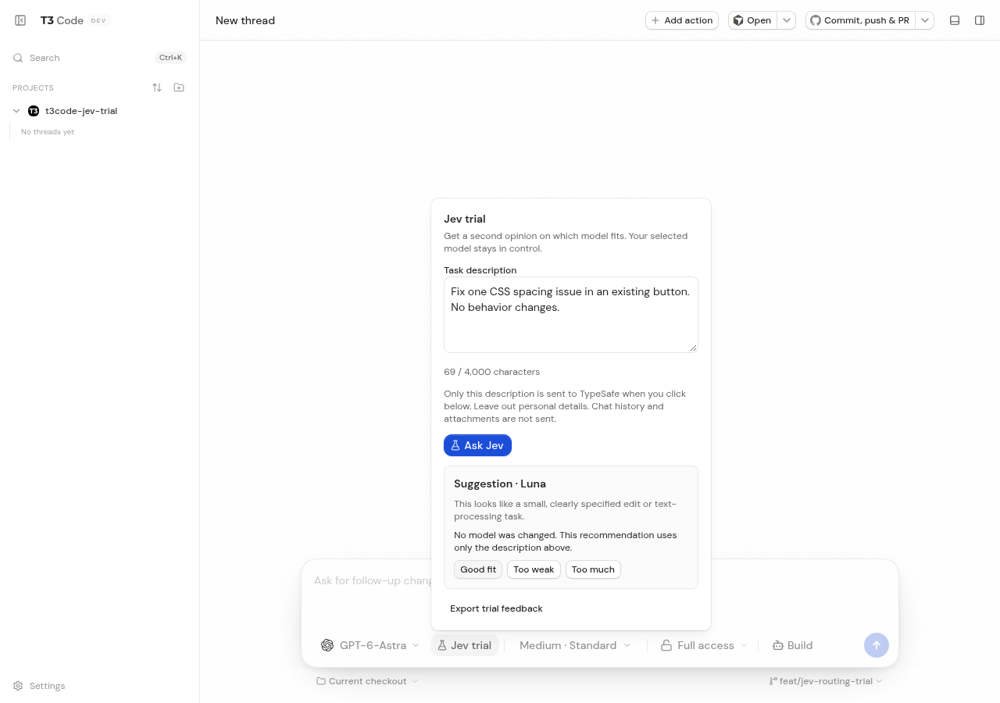
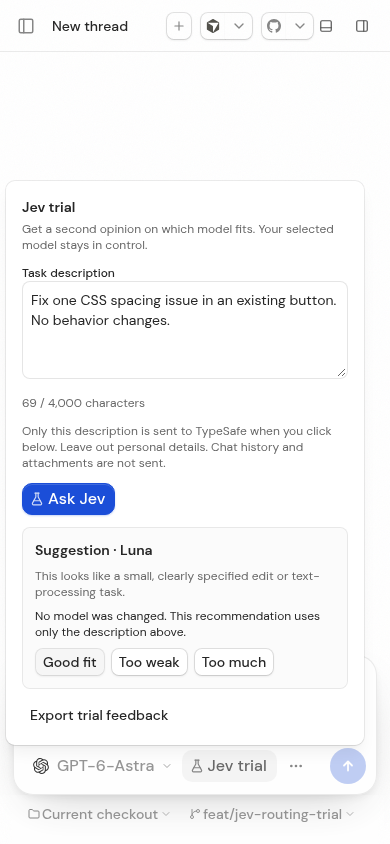

# Jev trial browser verification

Captured on 2026-09-20 from the real development frontend and authenticated
server in this branch, using isolated test state and synthetic task text.
These are functional browser screenshots, not design mockups.

| Desktop, 1280 × 900                    | Phone viewport, 390 × 844           |
| -------------------------------------- | ----------------------------------- |
|  |  |

Verified interactions:

- Opened the trial and edited the description: zero recommendation RPCs.
- Clicked **Ask Jev**: exactly one RPC, actual TypeSafe response, Luna suggested
  for a small CSS edit; GPT-6-Astra remained selected.
- Saved **Good fit**: browser storage held only time, lane, confidence, selected
  family and rating; no description text.
- Reopened and used the trial at phone dimensions, with no horizontal overflow.
- Edited the description again and requested `continue`: the server blocked it before
  any TypeSafe request and returned continuation guidance. No new task was
  submitted to a coding agent.

The checks found and fixed mobile composer focus loss and the textarea's
changing accessible label. The in-app browser connector was unavailable, so
these checks used a fresh, headless Chromium context with isolated credentials.
No existing private browser profile or application form was opened.

Limits: phone viewport simulation is not physical phone testing. Windows
installation, nightly release delivery and real task savings are not verified
by these screenshots. Packaging assertions were subsequently updated for the
fork's own application ID, and the full local test suite passed.
